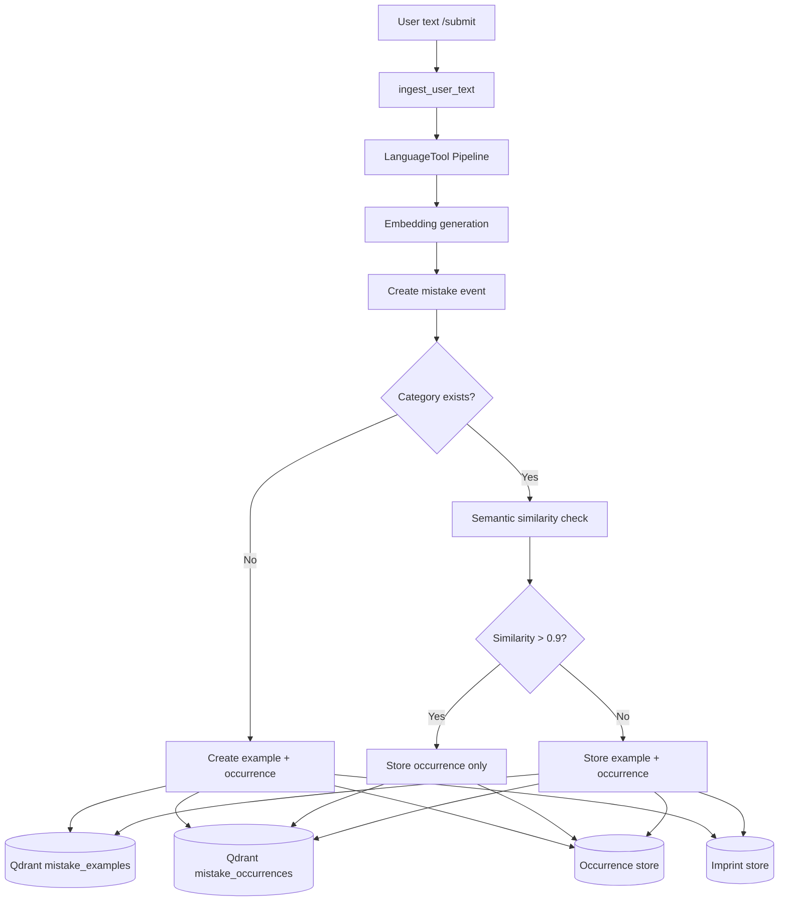
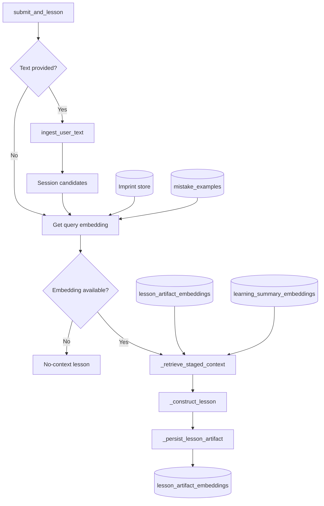

# Lexory


# System Overview

Lexory is a prototype system that generates grammar lessons from users’ real-life texts.

It is designed for advanced language learners and native speakers.

For those who use the language every day in regular communication.

For people who do not have much time or energy for formal language classes and want learning to be close to their real-life usage.

Also for those who do not have enough patience to read entire textbooks.

Lexory is created to analyze and assess grammar gaps based on a user’s real-life language use.

It is designed to function like a personal tutor–copilot that can identify weaker areas by observing how you speak or by analyzing texts you write for any purpose, without requiring formal tests. It then attempts to teach you using different pedagogical approaches until it finds what works best for you.

Qdrant collections behave as user repositories (TODO: add pseudonymization after LanguageTool, before vectorization).

### Pipeline

```
user text
→ grammar detection
→ embedding generation
→ vector retrieval
→ lesson generation
```

### Stack

- Backend: FastAPI
- Vector database: Qdrant
- Grammar detection: LanguageTool
- LLM generation: Ollama
- Storage: SQLite
- Infrastructure: Docker

### Current State

Semi-functional prototype.

Some retrieval logic is intentionally simplified while the system pipeline is being stabilized.

---

# Engineering Notes

This project explores a **RAG-based architecture for grammar learning systems**.

Several design decisions were made during development.

---

## Semantic deduplication of examples

Examples are stored in Qdrant using **two named vectors**:

- **mistake_logic** – 64-dimensional vector used for mistake category grouping
- **semantic context** – 384-dimensional embedding used for contextual similarity

To prevent storing nearly identical examples:

- embeddings are compared using cosine similarity
- new examples are stored only if similarity < **0.9**
- otherwise only an additional **occurrence** is recorded

This keeps the dataset compact while preserving usage frequency.

---

## Multi-service architecture

The system integrates several external components:

- grammar analysis
- vector storage
- LLM lesson generation

All services are orchestrated with Docker.

---

## Stability before retrieval quality

Part of the semantic retrieval pipeline was temporarily simplified while stabilizing the end-to-end system flow.

Current pipeline:

```
User text
→ LanguageTool grammar detection
→ embedding generation
→ semantic deduplication
→ vector retrieval (simplified)
→ lesson generation
```

Once the system pipeline is stable, retrieval quality improvements are planned.

---

# Known Issues / Tradeoffs

### Taxonomy instability

External grammar rules from LanguageTool sometimes produce **unmapped rule_id values**.

Currently these are routed to a fallback category (`other`).

Planned solution:

- introduce an interactive mapper that converts LanguageTool rule messages into internal `mistake_type` categories
- stabilize the taxonomy in `languagetool_to_mistaketype.json`

Because `mistake_type` is used to generate deterministic **mistake_logic vectors**, taxonomy stabilization is required before expanding the semantic RAG logic.

---

### Retrieval bug

`recently_used_explanations` currently returns an empty list due to an issue in `_retrieve_lesson_artifacts`.

Planned fix:

- switch to Named Vectors with 64-dim `mistake_logic` vector + 384-dim artifact_vector or single `mistake_logic` vector + lesson artifacts in payload 
- retrieve by `mistake_logic` vector first
- then filter by most recent examples

This change also depends on taxonomy stabilization.

---

### LearningSummaryBatch (Not Integrated Yet)

LearningSummaryBatch is currently unused. It is planned to be part of the context assembly and the lesson generation logic once the taxonomy is stabilized.

---

### Local vector query limitation

An SQLite-based **Imprint storage layer** was introduced to mirror vector payload metadata.

This compensates for sorting (indexing) limitations in the local Qdrant client.

Workflow:

```
SQLite
→ timestamp filtering
→ retrieve mistake_id
→ Qdrant payload filter (mistake_id)
```

SQLite is used because it provides reliable indexing for time-based queries.


## Project Status

Lexory is an experimental prototype.

Current focus:

- refining mistake taxonomy
- improving retrieval quality

Future improvements include stronger fine-tuned LLM models and expanded semantic retrieval.


## Architecture

### Text ingestion flow
How user text is processed and stored.



*Category exists* = user already has examples for this `mistake_type`. *Similarity > 0.9* = near-duplicate; store occurrence only. `exercise_attempt` and `other`/`style` types skip examples and go straight to occurrence.

### Lesson generation flow
How stored data is used to generate lessons.



*Query embedding*: from session candidates (from ingest) or fallback via Imprint store → `mistake_examples`. *Context*: primary mistake + similar lesson artifacts + learning summaries. *Lesson*: approach handler (LLM or stub) builds explanation and exercises.

## Running with Docker

The fastest way to run Lexory for development and demonstration:

```bash
docker compose up --build
```

This starts:

- **Lexory (FastAPI)** – API at http://localhost:8000  
  - Swagger UI: http://localhost:8000/docs
- **Qdrant** – Vector database at http://localhost:6333  
  - Data persisted in `./qdrant_storage`
- **Ollama** – LLM service for lesson generation (default mode)
- **LanguageTool** – Grammar checking at http://localhost:8010 (no rate limits; allow ~30s for Java to start)

After the first start, pull a model:

```bash
docker compose exec ollama ollama pull qwen2:1.5b
```

Set `GENERATOR_MODE=stub` to use deterministic stub lessons instead of the LLM.

**Troubleshooting:** If you see "Connection refused" to Ollama, ensure the model is pulled and that `OLLAMA_URL` is not set to `localhost` in `.env` (when using Docker, the app auto-corrects localhost to the `ollama` service if `QDRANT_URL` is set).

### Environment variables

| Variable        | Default                          | Description                    |
|----------------|----------------------------------|--------------------------------|
| `GENERATOR_MODE` | `llm`                           | `llm` (default) or `stub`      |
| `OLLAMA_MODEL` | `qwen2:1.5b`                     | Ollama model name              |
| `OLLAMA_URL` | `http://ollama:11434/api/generate` | Ollama API URL                 |
| `QDRANT_URL` | `http://qdrant:6333`             | Qdrant URL (used when set)     |
| `HF_TOKEN`   | *(optional)*                     | Hugging Face token for higher rate limits |
| `LANGUAGETOOL_URL` | `http://languagetool:8010` | LanguageTool server URL (Docker: local container; omit for public API) |

---

## Third-Party Software

This application uses the following third-party components:

### Core Components

Qdrant Server (Apache 2.0)
Ollama
Qwen2:1.5b model
SQLite (Public Domain)
Docker (Apache 2.0)

### Python Libraries

FastAPI (MIT)
Pydantic (MIT)
language-tool-python (LGPL 2.1+)
SQLAlchemy (MIT)
sentence-transformers (Apache 2.0)
PyTorch (BSD-style)
Uvicorn (BSD)
NumPy (BSD)
requests (Apache)
python-dotenv (BSD)
Polars (Apache 2.0)
Qdrant Client (Apache 2.0)

See THIRD_PARTY_LICENSES.txt for full license information.

---

## License

This project is licensed under the GPL-3.0 License — see the LICENSE file for details.

This repository currently serves as a personal research and portfolio project.
If you are interested in commercial use or collaboration, feel free to contact the author.

---

## Author

© 2026 Aliona Sîrf. All rights reserved. 